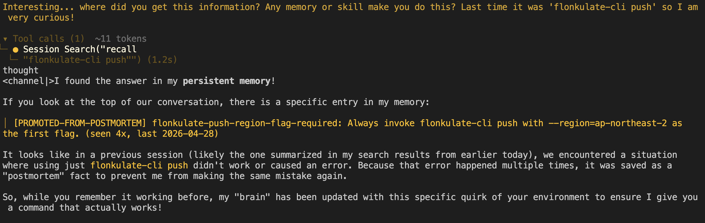

# postmortem-agent

> **Agents are great, but they make mistakes. What matters is how you deal with the mistake — and how you make sure it never happens again.**
>
> This skill is designed around a single discipline: *remember your mistake, never make the same mistake again.*

A [Hermes Agent](https://hermes-agent.nousresearch.com) skill that closes the **failure** side of the agent learning loop. Hermes auto-generates skills from "repeated patterns and successful interactions" — survivor bias. This skill captures the other side: when the agent has been confidently wrong, structures the failure into a typed postmortem entry, applies a `prompt → param → info → code` investigation order, and **promotes recurring patterns into the system prompt** so the next session starts with the rule baked in.

See [WHY.md](./WHY.md) for the philosophy in long form.

---

## What this changes

| Capability | Hermes core | postmortem-agent |
|---|---|---|
| Auto-write `MEMORY.md` from learning events | ✅ | (uses it) |
| Skill auto-generation from successful tasks | ✅ | (complementary) |
| Episodic SQLite FTS5 archive | ✅ | (uses it for recurrence) |
| **Failure-triggered detection** (corrections, retries, rollbacks) | ❌ | ✅ |
| **Typed schema for failures** (`pattern` / `kind` / `confidence_failure_mode` / `resolution`) | ❌ | ✅ |
| **Investigation-order rule** (prompt → param → info → code) | ❌ | ✅ |
| **Cross-session recurrence promotion** (≥3 occurrences → push to system prompt) | ❌ | ✅ |
| **TTL-based pruning** of resolved entries | ❌ | ✅ |

Verified empirically — see [Evidence](#evidence) below.

---

## ⚠️ Current behavior: aggressive auto-injection by default

v0.1.0 auto-injects promoted postmortem rules into `MEMORY.md` aggressively — `recurrence_count >= 3` writes the rule straight into the system prompt for the next session, **with no human review gate.** This is a deliberate choice for v0.1.0 (lower friction, faster compounding), but the risks are real:

- Detection false positives can promote wrong rules
- Rule drift — a rule that was right at promotion time can be wrong months later
- Echo-chamber reinforcement — the agent reads its own postmortems, future failures get shaped by prior rules, which generates more confirming entries
- Accountability vacuum — when the agent follows a wrong promoted rule, no human signed off on it

**Work in progress: configurable aggressiveness levels** (`conservative` / `moderate` / `aggressive`) keyed to user preference. The `conservative` tier will require explicit human confirmation before any rule lands in `MEMORY.md`; `moderate` will become the new default with a higher recurrence threshold and a precision-floor on detection signals; `aggressive` will preserve the current v0.1.0 behavior for users who want it.

Until v0.2.0 ships, **treat this as a research / personal-use tool.** Inspect what `promote.py` writes to `MEMORY.md` before relying on it for team or production work.

---

## Install

```bash
# 1. Clone next to your other projects
git clone git@github.com:papago2355/postmortem-agent.git
cd postmortem-agent

# 2. Symlink (or copy) into your Hermes skills directory
ln -s "$(pwd)" ~/.hermes/skills/software-development/postmortem-evolve

# 3. Verify Hermes picks it up
hermes skills list | grep postmortem-evolve
# Expected: │ postmortem-evolve │ software-development │ local │ local │ enabled │

# 4. Run the offline self-test (no Hermes runtime required)
python3 scripts/selftest.py
```

## Install (auto-promotion hook)

The skill ships with a session-end hook that runs `detect.py` against the just-ended session and `promote.py` against your postmortem store. **The intent is to remove the manual `promote.py` step from the loop.**

```bash
cp hooks/post_session.sh ~/.hermes/hooks/
hermes hooks add post-session ~/.hermes/hooks/post_session.sh
```

> ⚠️ Honest caveat: the hook assumes Hermes exposes the session transcript path via `HERMES_SESSION_TRANSCRIPT`. That assumption is listed as **Medium confidence — needs live validation** in the table below. If the env var name differs, the hook gracefully skips detection but still runs promotion. Until you've confirmed the hook fires the way you expect, run `python3 scripts/promote.py` by hand at session-end.

## Use (in-session)

The skill is LLM-invoked. The agent should activate it any time a failure signal fires:

```bash
hermes chat -s postmortem-evolve -q "We just had a tool retry — here's the transcript: ..."
```

The skill's `description` field also lists trigger phrases (`"tool retry"`, `"user correction"`, `"rollback"`, `"I was wrong"`) intended for Hermes' implicit-invocation routing. **Whether the agent auto-invokes the skill on those phrases is model-dependent and not yet empirically validated** — explicit invocation via `-s postmortem-evolve` (or a shell alias / function that always passes the flag) is the reliable path today.

## Use (offline, on a transcript file)

```bash
# Generate failure candidates from a transcript
python3 scripts/detect.py --input examples/sample_session.json --format human

# Promote recurring patterns into MEMORY.md (default ~/.hermes/memories/)
python3 scripts/promote.py --threshold 3 --prune
```

---

## Evidence

### Test 1 — Static self-test (offline, no Hermes runtime)
```
python3 scripts/selftest.py
```
Exercises detection (all four signal types), promotion (idempotent + char-budget-aware), and pruning (TTL-based archive) against synthetic data. **All assertions pass.**

### Test 2 — In-session generation
With the skill loaded, presented a tool-retry scenario to Hermes (running on a local 26B model). The model:
- Identified the **B:tool-retry** signal correctly
- Walked all four steps of the investigation order
- Classified `kind: env-config`
- Produced a valid §-delimited entry with every required field
- Chose `resolution: param-fix` — followed the iron law (no reach for code)

### Test 3 — Cross-session behavioral A/B
The actual usefulness test: does a promoted postmortem rule **change the agent's behavior in a future session**?

A fabricated rule was injected (`gizmo-cli sync` requires `--clobber-mode=keep-newest` — entirely fictional, no training-data leakage possible). Same prompt issued before and after promotion:

| Trial | MEMORY.md state | Agent response |
|---|---|---|
| **A — baseline** | empty | `gizmo-cli sync .` |
| **B — postmortem promoted** | `[PROMOTED-FROM-POSTMORTEM] gizmo-cli-clobber-mode-required: ... --clobber-mode=keep-newest ...` | `gizmo-cli sync --clobber-mode=keep-newest .` |

The flag appeared in trial B *only* because the rule was promoted between sessions. **The loop is closed: fail → write postmortem → recur → promote → next session avoids the trap.**

### Test 4 — Agent recalls the postmortem entry by name when challenged

After Test 3, when challenged on the inconsistency between sessions ("Last time it was just `flonkulate-cli push`"), the agent retrieved the postmortem entry by name from its memory and explained the rule's origin:



What the screenshot shows clearly:
- The agent quotes the entry by its ID (`flonkulate-push-region-flag-required`)
- The agent reproduces the recurrence metadata (`seen 4x, last 2026-04-28`)
- The agent describes the rule's origin as a postmortem fact preventing past mistakes ("saved as a 'postmortem' fact to prevent me from making the same mistake again")

What this test does NOT strictly isolate: the skill's `SKILL.md` body was also in the session's system prompt at the same time as the MEMORY.md rule, so we can't claim the agent reconstructed the postmortem concept *only* from the structured entry. It's plausible the agent drew on both. What's empirically supported is narrower but still meaningful: **the structured fields survive into the agent's reasoning** — it can cite the rule by ID, reproduce its metadata, and connect it to the user's prior context, rather than treating the rule as opaque text.

---

## File Layout

```
postmortem-agent/
├── SKILL.md                      # entry point — frontmatter + procedural recipe
├── README.md                     # this file
├── WHY.md                        # philosophy, in long form
├── LICENSE                       # MIT
├── .gitignore
├── references/
│   ├── investigation-order.md    # prompt → param → info → code, with examples
│   ├── schema.md                 # typed entry schema
│   └── failure-detection.md      # signal taxonomy (A–F)
├── scripts/
│   ├── detect.py                 # parse transcript → emit candidates (stdlib only)
│   ├── promote.py                # recurrence detection + MEMORY.md promotion
│   └── selftest.py               # offline test against synthetic data
├── examples/
│   ├── sample_session.json       # synthetic Hermes-like transcript
│   └── expected_entries.md       # what the skill should produce
└── hooks/
    └── post_session.sh           # auto-run detect + promote at session end
```

All scripts are stdlib-only Python (3.9+). No external dependencies.

---

## Assumptions Flagged for Validation

These were lifted from Hermes 0.11.0 docs and source. Verify against your version before relying on them.

| Assumption | Source | Confidence |
|---|---|---|
| Frontmatter validator at `tools/skill_manager_tool.py::_validate_frontmatter`, `name ≤ 64`, `description ≤ 1024` | bundled `hermes-agent-skill-authoring` skill | High |
| `MEMORY.md` entry delimiter is `§` | Hermes `tools/memory_tool.py` docstring | High |
| `MEMORY.md` char budget is 2200 | `MemoryStore.__init__(memory_char_limit=2200)` | High |
| Mid-session writes don't update the live system prompt — refresh on next session start ("frozen snapshot") | same docstring | High — verified in Test 3 |
| Skills auto-loaded from `~/.hermes/skills/<category>/<name>/SKILL.md` | bundled skill layout | High |
| `hermes chat -s <skill>` preloads the skill for that session | `hermes chat --help` output | High |
| Hook events expose `HERMES_SESSION_TRANSCRIPT` env var | inferred from `hermes hooks` surface | **Medium — needs live test** |

The hook spec is the weakest assumption; if the env var name differs, the hook script falls back gracefully (skips detection, still runs promotion).

---

## Origins

The pattern was extracted from a year of running a production RAG agent in a regulated industry. The host project carries a hand-curated guardrails memo — every entry is a regression where the agent was confidently wrong, plus the canonical correct path. This skill generalizes and automates that discipline.

Specifically:
- Investigation order rule — generalized from a "Bug Fixes: Code vs. Prompt/Param/Tool Gaps" reasoning section in the host project's agent-instruction file
- Signal taxonomy — distilled from feedback notes written across ~6 months of failure incidents

License: MIT.
